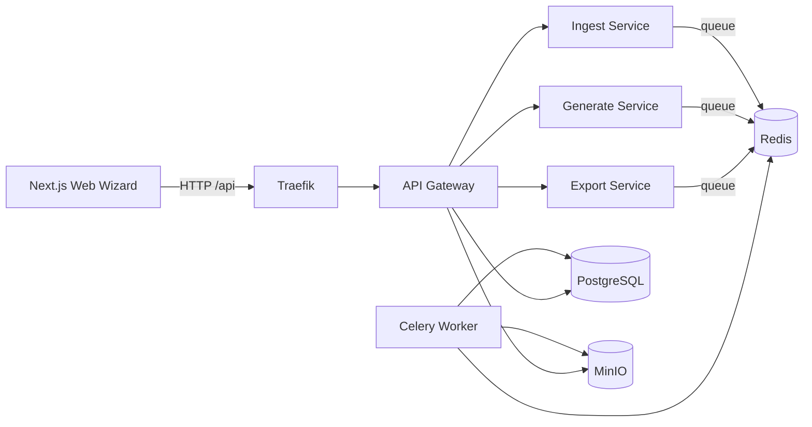

# SkillBeam Monorepo

SkillBeam is a microservices-based pedagogical content wizard built with FastAPI + Celery + Next.js.

## Version legere (dossier separe)

Ce projet est une copie autonome dans un dossier dedie:

- `/Users/tayebhamidi/Documents/Codex/pronote-pour-skillbeam-lite`

Optimisations appliquees:

- web en mode production stable (`next start`) pour eviter les erreurs hot-reload
- image web multi-stage (runtime plus leger)
- contexte Docker reduit via `.dockerignore`
- nettoyage des caches Python (`__pycache__`, `*.pyc`)

Demarrage rapide (mode leger):

```bash
cd /Users/tayebhamidi/Documents/Codex/pronote-pour-skillbeam-lite
./start-lite.sh
```

Arret:

```bash
./stop-lite.sh
```

## Features

- Multi-source ingestion: `Document`, `Texte`, `Thematique`, `YouTube` (transcription captions via `youtube-transcript-api` + fallback `yt-dlp`, with explicit failure if unavailable)
- Generation templates: course structure, MCQ, polls, open questions, cloze, matching, brainstorming, flashcards
- Human-in-the-loop editor UI (wizard flow, inline item edition)
- Export plugins: `docx`, `pdf`, `xlsx`, `moodle_xml`, `pronote_xml`, `qti`, `h5p`, `anki`
- Async jobs with progress and logs (`Celery + Redis`)
- Object storage with presigned uploads/downloads (`MinIO`)
- JSON structured logs + correlation-id middleware + OpenTelemetry bootstrap

## Monorepo Layout

- `/apps/web` Next.js wizard UI
- `/services/api-gateway` FastAPI BFF (auth, project APIs, orchestration, rate-limit)
- `/services/ingest` FastAPI ingestion orchestrator
- `/services/generate` FastAPI generation orchestrator
- `/services/export` FastAPI export orchestrator + plugin registry wrapper
- `/services/worker` Celery workers for parse/generate/export pipelines
- `/shared/python/shared` domain schemas, ORM, parsers, providers, exporters
- `/infra` Traefik config
- `/docs` architecture and API notes
- `/samples` export samples (including PRONOTE XML)

## Architecture



## Quick Start (Docker Compose)

```bash
docker compose up --build
```

### Use Mistral API for generation

Create/update `.env` at repo root:

```bash
LLM_PROVIDER=mistral
MISTRAL_API_KEY=YOUR_MISTRAL_API_KEY
MISTRAL_MODEL=mistral-large-latest
# optional
MISTRAL_BASE_URL=https://api.mistral.ai/v1
# optional for YouTube transcript reliability (429 / geo restrictions)
# YOUTUBE_PROXY_URL=http://your-proxy:3128
# YOUTUBE_COOKIES_HOST_FILE=/absolute/path/to/youtube_cookies.txt
# YOUTUBE_COOKIES_FILE=/run/secrets/youtube_cookies.txt
```

Then reload only generation services:

```bash
docker compose up -d --build --no-deps generate worker
```

Services:

- App UI: [http://localhost](http://localhost)
- API via Traefik: [http://localhost/api](http://localhost/api)
- Traefik dashboard: [http://localhost:8080](http://localhost:8080)
- MinIO console: [http://localhost:9001](http://localhost:9001)
- MinIO S3 endpoint (presigned URLs): [http://localhost:9000](http://localhost:9000)

## Database Migrations (Alembic)

```bash
docker compose run --rm migrate
```

`migrate` runs automatically on `docker compose up --build` through `depends_on: service_completed_successfully`.

## API Endpoints (BFF)

- `POST /v1/auth/token`
- `POST /v1/projects`
- `GET /v1/projects/{id}`
- `POST /v1/projects/{id}/sources`
- `POST /v1/projects/{id}/ingest`
- `POST /v1/projects/{id}/generate`
- `GET /v1/jobs/{job_id}`
- `GET /v1/projects/{id}/content`
- `PUT /v1/projects/{id}/content`
- `POST /v1/projects/{id}/export`
- `GET /v1/exports/{export_id}/download`
- `GET /health` on every service

### Curl Example (Happy Path: Document -> MCQ -> DOCX/PRONOTE)

1) Token

```bash
TOKEN=$(curl -s http://localhost/api/v1/auth/token \
  -H 'Content-Type: application/json' \
  -d '{"email":"demo@skillbeam.local","password":"demo123"}' | jq -r .access_token)
```

2) Create project

```bash
PROJECT_ID=$(curl -s http://localhost/api/v1/projects \
  -H "Authorization: Bearer $TOKEN" \
  -H 'Content-Type: application/json' \
  -d '{"title":"Cours Histoire"}' | jq -r .id)
```

3) Init upload (PDF)

```bash
INIT=$(curl -s http://localhost/api/v1/projects/$PROJECT_ID/sources \
  -H "Authorization: Bearer $TOKEN" \
  -H 'Content-Type: application/json' \
  -d '{"source_type":"document","filename":"cours.pdf","mime_type":"application/pdf","size_bytes":12345}')
UPLOAD_URL=$(echo "$INIT" | jq -r .upload_url)
ASSET_ID=$(echo "$INIT" | jq -r .asset_id)
```

4) Upload file to MinIO presigned URL

```bash
curl -X PUT "$UPLOAD_URL" \
  -H 'Content-Type: application/pdf' \
  --data-binary @cours.pdf
```

5) Launch ingest

```bash
INGEST_JOB=$(curl -s http://localhost/api/v1/projects/$PROJECT_ID/ingest \
  -H "Authorization: Bearer $TOKEN" \
  -H 'Content-Type: application/json' \
  -d "{\"source_asset_id\":\"$ASSET_ID\"}" | jq -r .job_id)
```

6) Launch generate (MCQ)

```bash
GEN_JOB=$(curl -s http://localhost/api/v1/projects/$PROJECT_ID/generate \
  -H "Authorization: Bearer $TOKEN" \
  -H 'Content-Type: application/json' \
  -d '{"content_types":["mcq"],"instructions":"8 QCM niveau lycee"}' | jq -r .job_id)
```

7) Export PRONOTE XML

```bash
EXP_JOB=$(curl -s http://localhost/api/v1/projects/$PROJECT_ID/export \
  -H "Authorization: Bearer $TOKEN" \
  -H 'Content-Type: application/json' \
  -d '{"format":"pronote_xml","options":{"name":"SkillBeam","answernumbering":"123","niveau":"","matiere":""}}' | jq -r .job_id)
```

8) Export DOCX

```bash
EXP_JOB_DOCX=$(curl -s http://localhost/api/v1/projects/$PROJECT_ID/export \
  -H "Authorization: Bearer $TOKEN" \
  -H 'Content-Type: application/json' \
  -d '{"format":"docx","options":{}}' | jq -r .job_id)
```

## Testing

Run test suites per service:

```bash
# api gateway
cd services/api-gateway && pytest

# ingest
cd services/ingest && pytest

# generate
cd services/generate && pytest

# export (includes strict PRONOTE XML tests + docx/pdf)
cd services/export && pytest

# worker health
cd services/worker && pytest
```

## Export Notes

- PDF exporter uses **ReportLab** (chosen for lightweight deployment and no external rendering engine requirement).
- PRONOTE XML exporter is implemented as a **dedicated plugin** (`pronote_xml`), not an alias.
- QTI/H5P/YouTube/Audio pipelines include explicit TODO markers for production completion.

## Security/Quality Controls

- Upload MIME and size validation (`<= 200MB`)
- Presigned URLs for object storage operations
- No hardcoded API keys (provider selection from env)
- JWT auth minimal (TODO: RBAC)
- In-memory gateway rate limiting
- Structured JSON logs + correlation-id
- OpenTelemetry bootstrap with TODO for exporters/instrumentation
- Antivirus scan hook TODO (`ClamAV`) before ingest parse
